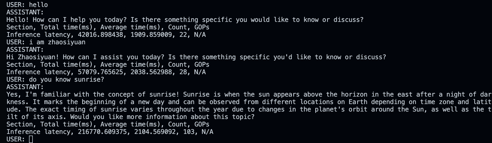

# yuangine

## 介绍

在x86和arm架构下，对llama2推理加速

纯c++实现，执行效率高

## 依赖

- [xmake](https://github.com/xmake-io/xmake)

## 使用方法

1. 安装[xmake](https://github.com/xmake-io/xmake)
2. 克隆仓库并进入目录：
    ```bash
    git clone https://github.com/zhaosiyuan1098/yuangine.git
    cd yuangine
    ```
3. 下载所需模型：
    ```bash
    cd ./model
    python download_model.py --model LLaMA_7B_2_chat --QM QM_ARM
    ```
3. 编译项目：
    ```bash
    cd ..
    xmake
    ```
4. 运行项目：
    ```bash
    xmake run
    ```

## 结构
参照llama2原始结构实现


[具体代码架构](./structure.txt)

## 效果展示

