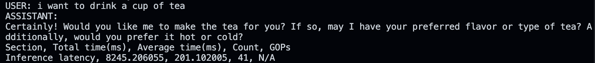
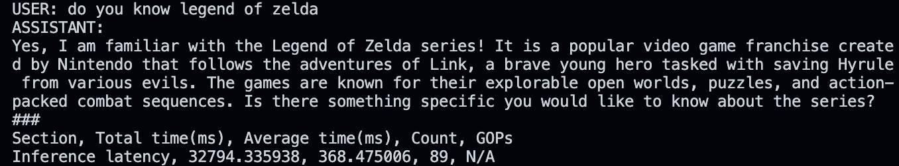
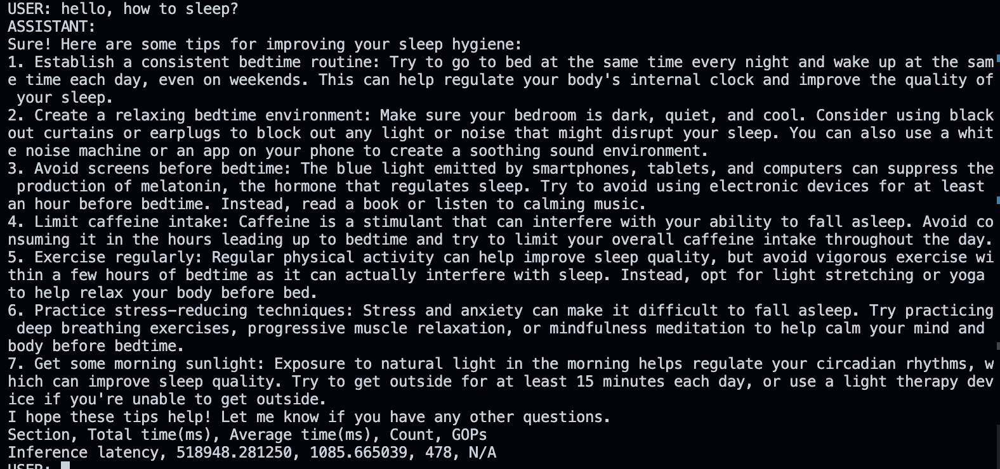
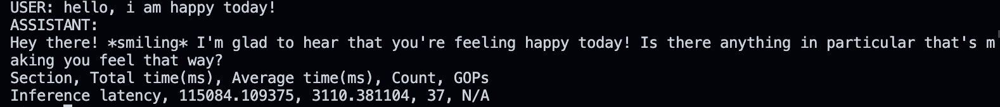

# llama_cpu

## 介绍
* 此项目旨在解决大语言模型（LLM）在CPU 端进行本地化部署时，现有推理框架普遍存在的体积臃肿、性能不佳、难以定制的问题。
* 不依赖任何第三方深度学习库，设计并实现了一个轻量级、跨平台的C++ 推理引擎。
在各类CPU 硬件上（从服务器到嵌入式设备）实现对Llama等Transformer 架构模型推理性能优化
* 为模型的私有化、 低成本和低延迟应用提供一个高效、可靠的解决方案

## 结构
参照llama原始结构实现


[具体代码架构](./structure.txt)

## 特点
* 从零构建核心算子库，为支持现代Transformer 模型，自主实现了RMSNorm、旋转位置编码(RoPE) 等关键模块。
* 使用 SIMD(AVX2/NEON) 指令集进行向量化加速
* 利用多线程技术提升并行处理能力
* 实现KV-Cache机制以降低生成延迟
* 自动检测cpu架构并编译对应代码
## 使用方法
### 下载代码

```bash
    git clone https://github.com/zhaosiyuan1098/llama_cpu.git
    cd llama_cpu
   ```
    
### 下载模型
* x86

```bash
    
    cd ./model
    curl -L -o LLaMA_7B_2_chat.zip "https://www.dropbox.com/scl/fi/vu7wnes1c7gkcegg854ys/LLaMA_7B_2_chat.zip?rlkey=q61o8fpc954g1ke6g2eaot7cf&dl=1"
    unzip LLaMA_7B_2_chat.zip

   ```
    
### 编译与运行

可选择cmake或xmake
* cmake
```bash
    cd ..
    mkdir "build" && cd ./build && cmake ..
    make 
    ./quick_infer
 ```

* [xmake](https://github.com/xmake-io/xmake)
```bash
    cd ..
    xmake
    xmake run
 ```

### 使用python下载其他模型（可选）
    ```bash
    conda create -n yuangine python=3.10
    conda activate yuangine
    pip install -r requirenments.txt
    cd ./model

    python download_model.py --model 想要下载的模型名 --QM 对应的架构
    ```


## 效果展示

### 使用各种方法加速效果对比
| 方法 | x86 加速比 | ARM 加速比 | 备注 |
|------|------------|------------|------|
| SIMD+多线程+循环展开 | 16.16x | 18.3x | 使用缓存加速 |
| SIMD | 8.83x | 10.24x | 单指令多数据 |
| 多线程 | 2.99x | 3.17x | 并行计算 |
| 循环展开 | 1.04x | 1.06x | 减少循环开销 |

### 运行结果
SIMD+多线程+循环展开:

SIMD:

多线程 

循环展开
